<a id="readme-top"></a>

<br />
<div align="center">
  <a href="https://github.com/ao3Bean/CSE299_Project.git">
    <!--  -->
  </a>

<h2 align="center">CSE 299 - Junior Capstone Project</h3>
<h3 align="center">Cadence</h3>

  <p align="center">
    This is the repository for our CSE 299 project and it contains all the code and documentation.
    <br />
    <a href="https://github.com/ao3Bean/CSE299_Project.git"><strong>Explore the docs »</strong></a>
    <br />
  </p>
</div>


<!-- TABLE OF CONTENTS -->
<details>
  <summary>Table of Contents</summary>
  <ol>
    <li>
      <a href="#about-the-project">About The Project</a>
    </li>
    <li><a href="#tech-stack">Tech Stack</a></li>
    <li>
      <a href="#features">Features</a>
    </li>
    <li><a href="#setting-up">Setting Up</a></li>
    <li><a href="#project-structure">Project Structure</a></li>
    <li><a href="#showcase">Project Showcase</a></li>
    <li><a href="#contributors">Contributors</a></li>
  </ol>
</details>


<!-- ABOUT THE PROJECT -->
## About The Project

<!-- [![Product Name Screen Shot][product-screenshot]](https://example.com) -->
This is the repository for our CSE 299 Junior Capstone Project.
Our project Cadence is a web-based virtual co-working platform intended to support focused study and work through shared presence and synchronized activity rather than continuous direct interaction.

### Who is Cadence for?
Candece is for students, hobbiest and remote workers who want a more interactive and engaging way to be productive. It is espescially aimed at people who prefer customization and real-time interaction with friends.

### Our Inspiration
The project was inspired by the idea of making an site that was focused on productivity. We took inspiration from popular games, focus apps, tools such as the Pomodoro Timer to create a site that willl help users be more productive and track their progress. We also wanted users to have 2D-avatar and this inspired us to make custom avatars specifically for this project.
<p align="right">(<a href="#readme-top">back to top</a>)</p>


## Tech Stack

* [![Djnago][djangoproject.com]][django-url]

| Layer | Technology |
|---|---|
| Backend Framework | Django |
| Real-time Communication | Django Channels + ASGI |
| Channel Layer | In-Memory Channel |
| Database | SQLite |
| Frontend | HTML5, CSS3, JS |
| Authentication | Django built-in auth |

<p align="right">(<a href="#readme-top">back to top</a>)</p>


<!-- GETTING STARTED -->
## Key Features
### Authentication & Accounts
- User signup and email/password authentication (register, login, logout)
- Email verification and password reset flows
- Account settings and profile page (display name, avatar, preferences)
- Custom Avatar Customization for new users

### Avatar Customization
- Avatar creation page with skin, hair, outfit, and face expression options
- Custom avatar art 

### Chat Room Functionality
<hr>

#### Chat Room Creation & Settings
- Create temporary or saved co-working rooms
- Public or private rooms with optional passcode protection
- Room settings: background preset, focus duration, break duration
- Host can save room settings to DB; all users can apply settings live via WebSocket
- Max participant limit per room with graceful full-room handling
- Share room via copyable link and passcode modal
- Join room via pasted link
- Temporary rooms expire after 24 hours; saved rooms persist

#### Presence & User Preferences
- Fully customizable layered avatars (skin, outfit, hair, face, desk layer)
- Avatar state broadcasting per user: idle, focused, break, chatting
- Avatar state auto-changes based on timer (focus/break) with manual override
- Typing in chat auto-triggers chatting state, reverts after 3 seconds of inactivity
- Toggle music, timer and chat on/off per user via sidebar

#### Pomodoro Timer
- Synchronized across all users in the room via WebSocket
- Any user can start, pause or reset — broadcasts to everyone
- Configurable focus and break durations
- Auto-switches between focus and break modes when timer hits zero
- New joiners receive current timer state on connect

#### Chatting
- Real-time chat via WebSocket
- System messages on user join/leave
- Unread message badge on chat toggle when chat is hidden

<hr>

### Friends
- Send and receive friend requests
- Friends list page
- See which friends are currently active
- Share links with friends for quick access to chat rooms
- In-app notifications for friend requests and shared room links

### Tasks
- Personal task list page
- Create, complete and delete tasks
- Calendar to keep track of tasks

### Session Analytics
- Track time spent in sessions
- View session history and activity over time


<p align="right">(<a href="#readme-top">back to top</a>)</p>


<!-- Setting Up -->
## Setting Up

### Prerequisites:
- Python 3.11+

### 1. Clone the repository
```bash
git clone "https://github.com/ao3Bean/CSE299_Project.git"
```
### 2. Create and activate virtual environment

#### Windows
Create virtual environment
```bash
python -m venv env 
```
Activate virtual environment
```bash
env\Scripts\activate
```
#### macOS/Linux
Create virtual environment
```bash
python3 -m venv env 
```
Activate virtual environment
```bash
source env/bin/activate
```

### 3. Install dependecies

```bash
pip install -r requirements.txt
```
### 4. Configure environment variables
Copy the example environment file (.env.example) inside the same directory.

__Windows__
```bash
copy .env.example .env
```
__macOS/Linux__
```bash
cp .env.example .env
```

### 5. Run migrations
```bash
python main.py migrate
```

### 6. Run Django Development Server
```bash
python main.py runserver
```
<p align="right">(<a href="#readme-top">back to top</a>)</p>


<!-- USAGE EXAMPLES -->
## Project Structure
```bash
# Project structure — top-level files and application modules
root                    
├── 📂 data               # database 
├── 📂 others             # project reports, documentation and slides
├── 📂 support            # main Django project 
│   ├── 📂 accounts       # app for user functions
│   ├── 📂 config         # app for Django settings and env config
│   ├── 📂 core           # app for shared models and features 
│   ├── 📂 room           # app for chat room functions
│   ├── 📂 static         # static assests (img, css, js and etc)
│   └── 📂 templates      # HTML templates for Django views
├── 📄 .env.example       # example env file
├── 📄 .gitignore         
├── 📄 main.py <--------- # main entry point 
└── 📄 README.md


```

<p align="right">(<a href="#readme-top">back to top</a>)</p>

<!-- USAGE EXAMPLES -->
## Showcase

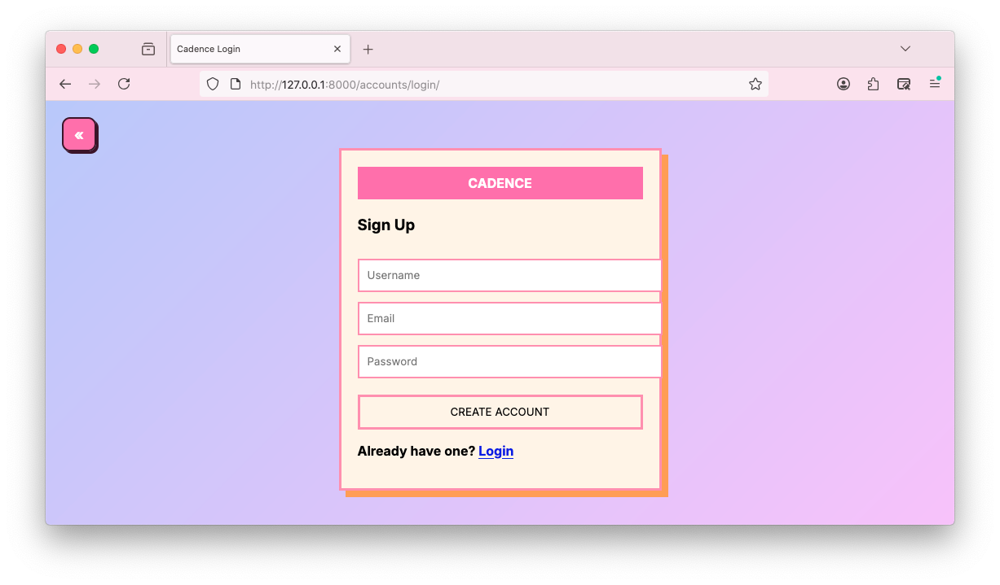
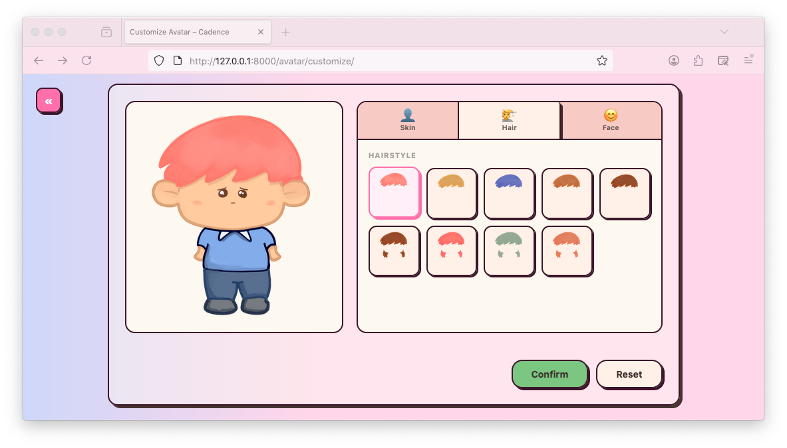
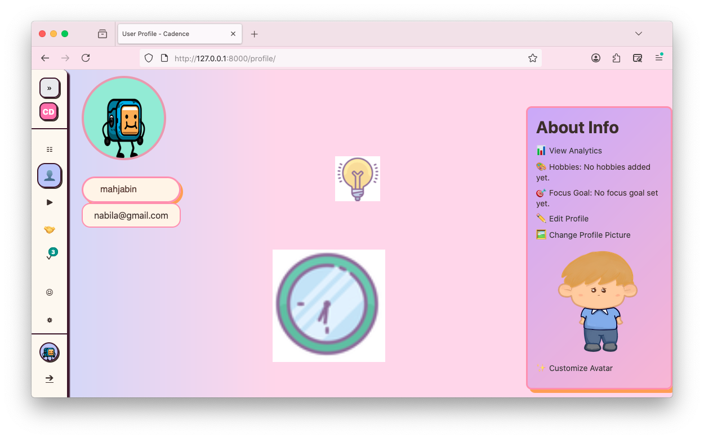
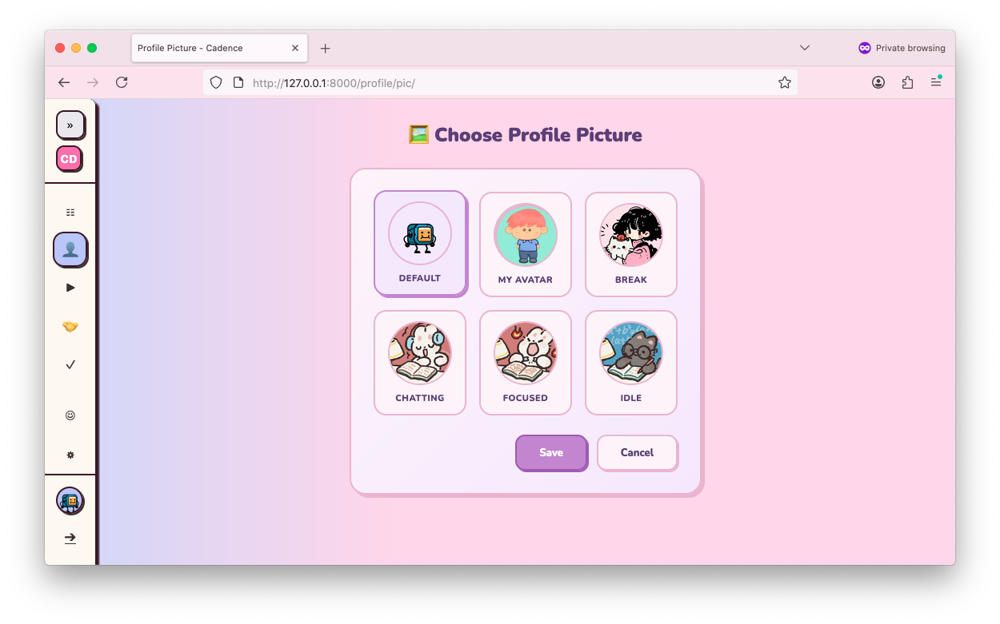
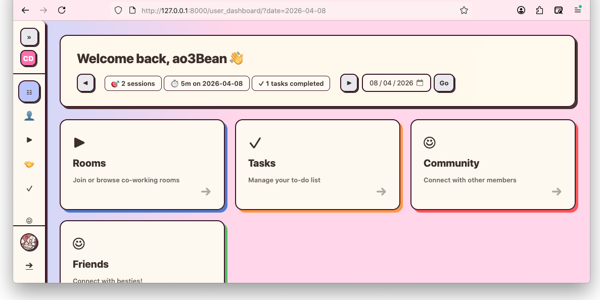
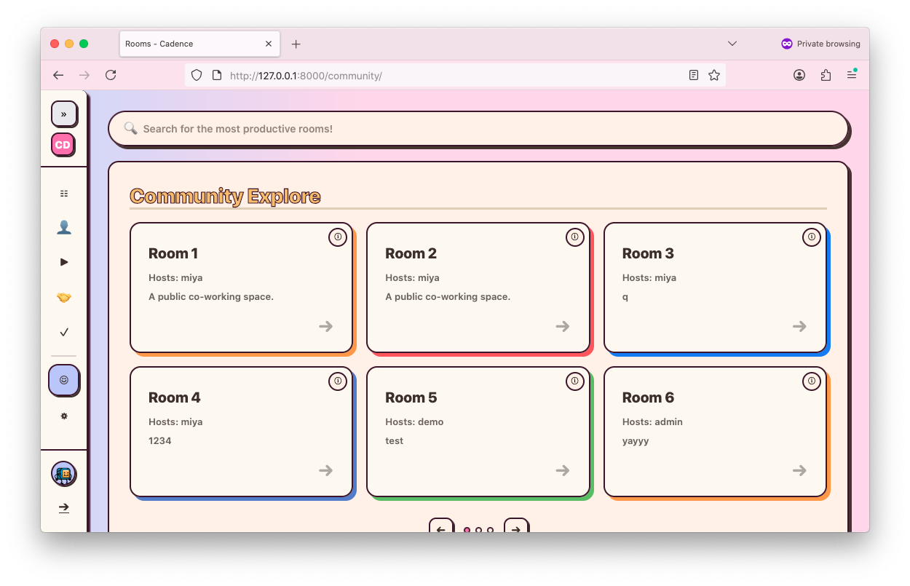
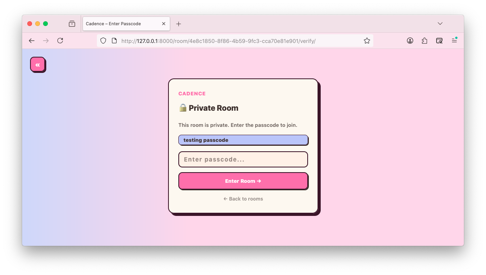
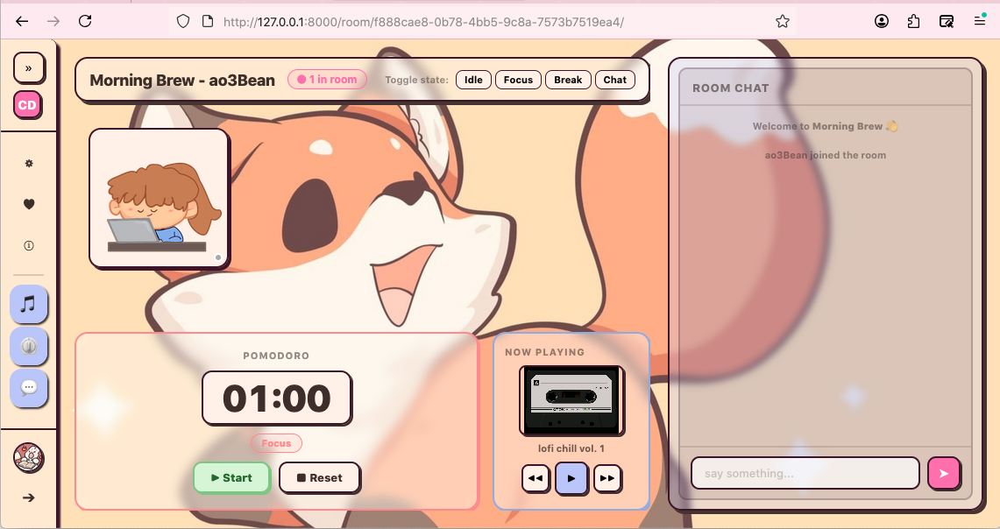
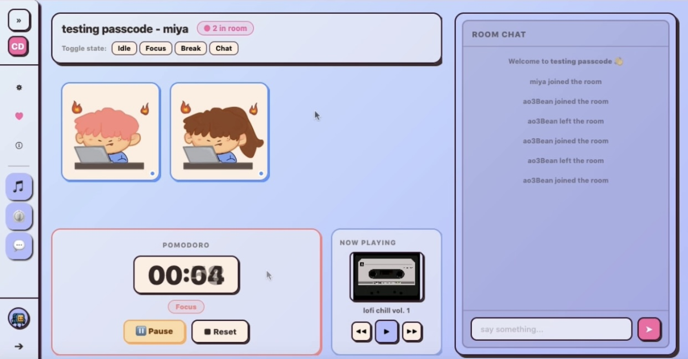
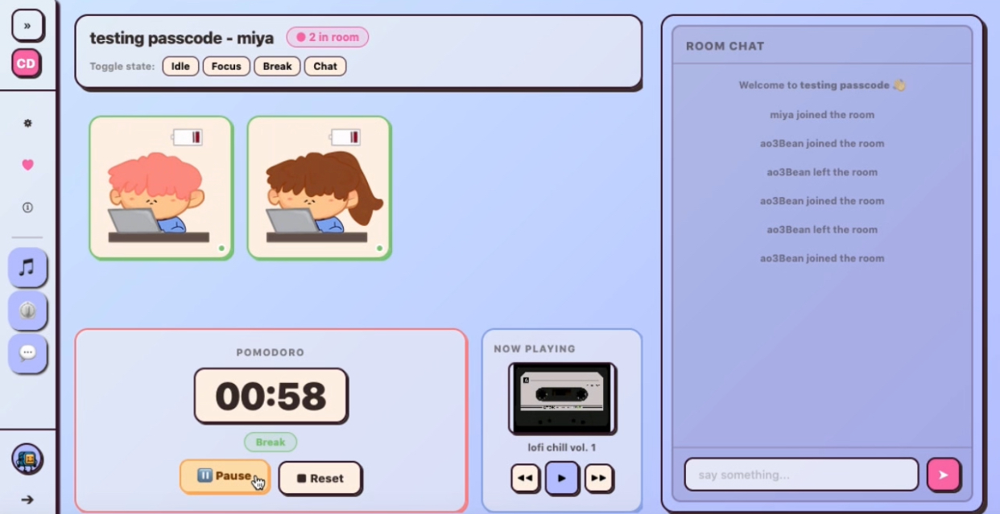

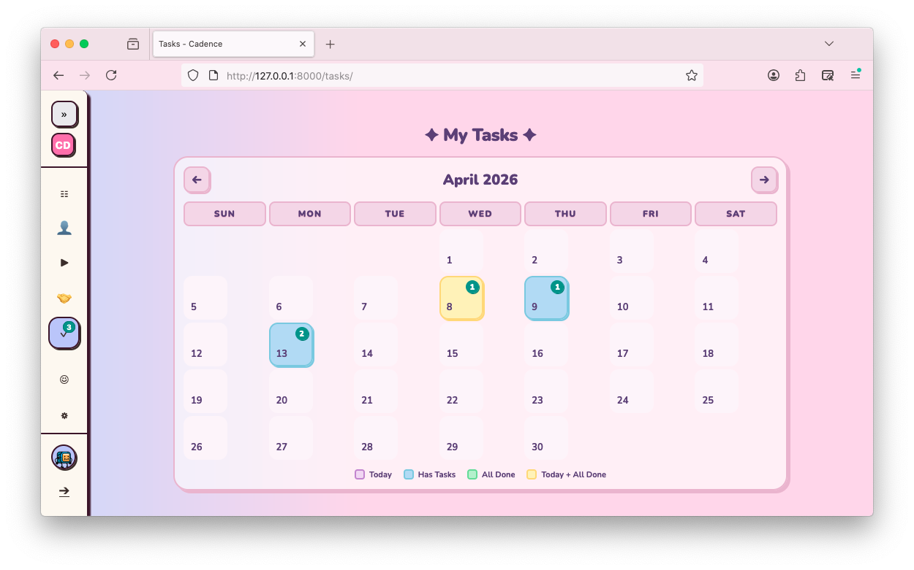
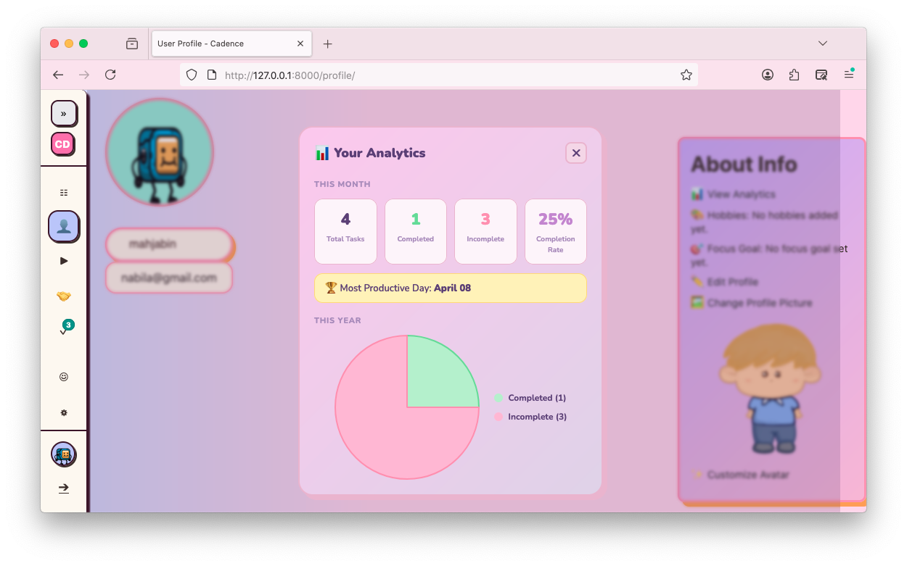
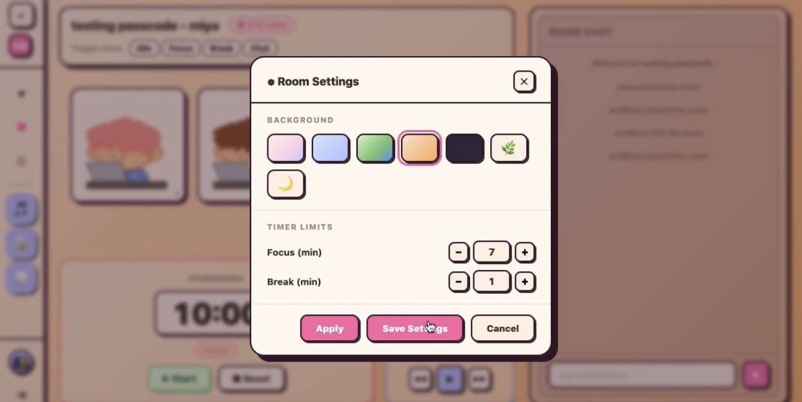

<p align="right">(<a href="#readme-top">back to top</a>)</p>


<!-- CONTRIBUTING -->
## Contributors

<ol>
  <li>Mahjabin Noor Nabila - <a href="https://github.com/ao3Bean">ao3Bean</a></li>
  <li>Ananya Sarkar - <a href="https://github.com/ananya0511sarkar-prog">ananya0511sarkar-prog</a></li>
</ol>

<p align="right">(<a href="#readme-top">back to top</a>)</p>


[djangoproject.com]: https://img.shields.io/badge/Django-092E20?style=for-the-badge&logo=django&logoColor=green
[django-url]:https://www.djangoproject.com/